# 1.项目介绍
- 功能模块：管理员（农家乐管理、美食信息管理、住宿信息管理、活动信息、用户管理、活动报名、论坛等），普通用户（注册登录、活动报名、客房预订、用户评价、收藏管理、模拟支付等）
- 技术选型：SSM， vue（后端管理web）、layui（前端门户）等
- 测试环境：idea2024、mysql5.7、maven3、tomcat8、jdk1.8（请认真看我的测试环境）
# 2.项目部署
- 通过navicat等工具创建数据库，导入db下的sql文件
- 通过idea打开项目，根据本地的数据库环境配置 4-6行（强调：数据库向下兼容，如果你本地数据库是8.*的，请注意修改pom.xml的版本，以及对应的数据库url添加时区，同时驱动名称要做修改）
- 配置tomcat，我的测试环境的application context配置为/ssms95f7
- 启动项目
- 后端管理web：http://localhost:8080/ssms95f7/admin/dist/index.html  管理员账号密码：abo、abo
- 前端门户：http://localhost:8080/ssms95f7/front/index.html  测试账号密码：wly、123456或者查看用户表

# 3.项目部署截图
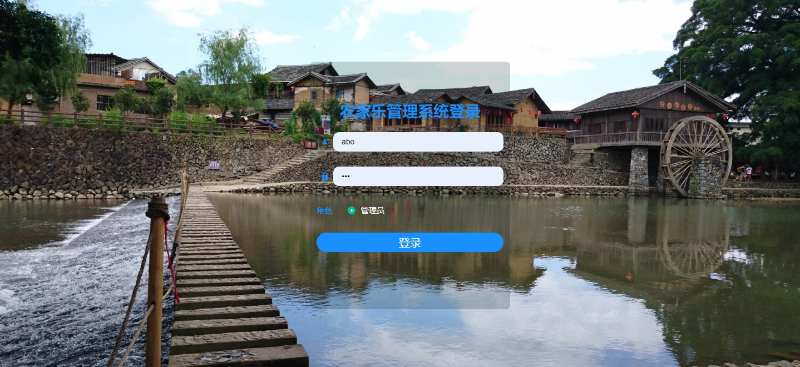
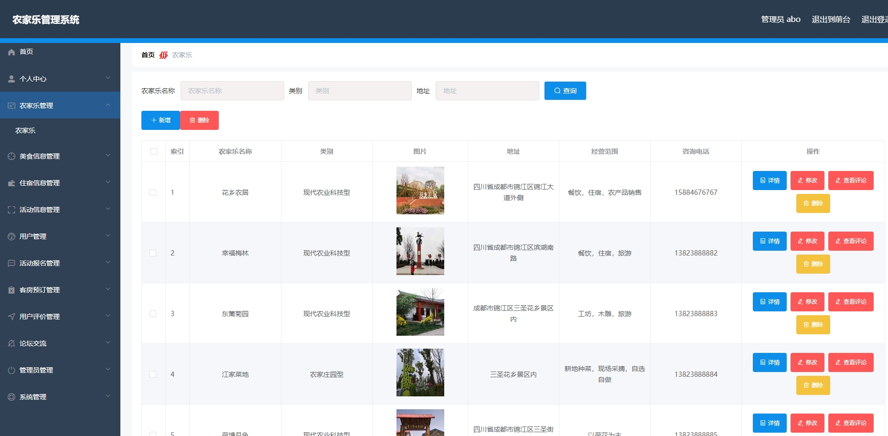
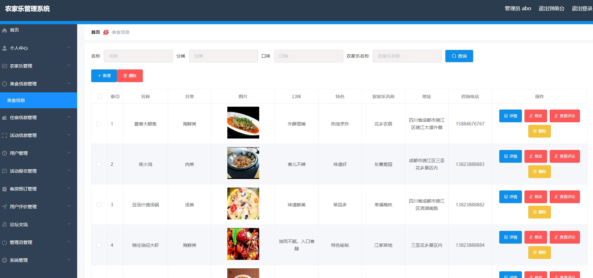
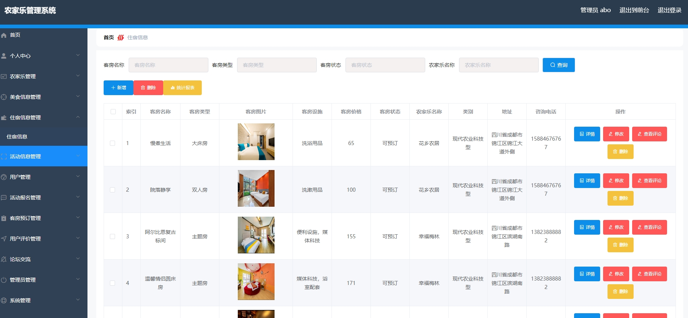
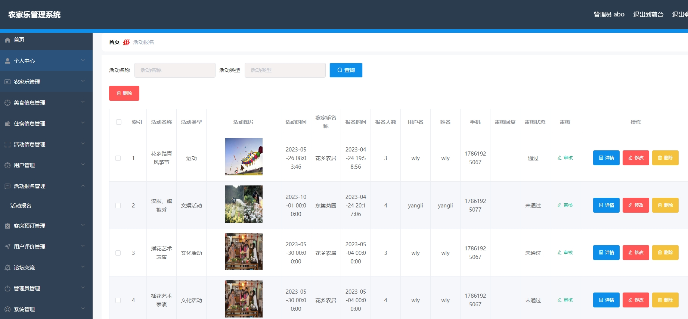
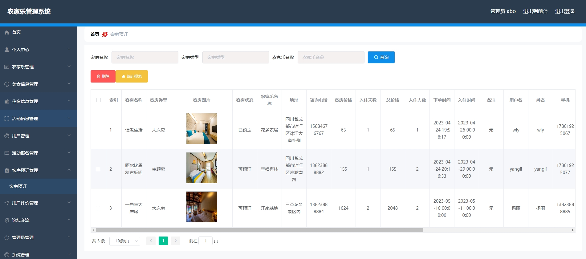
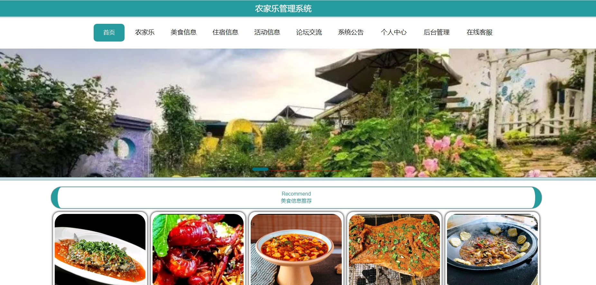
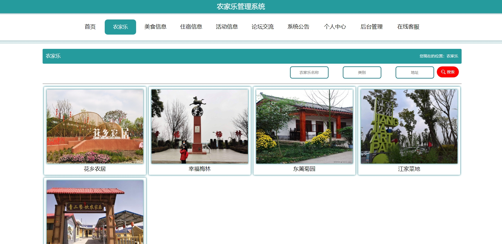
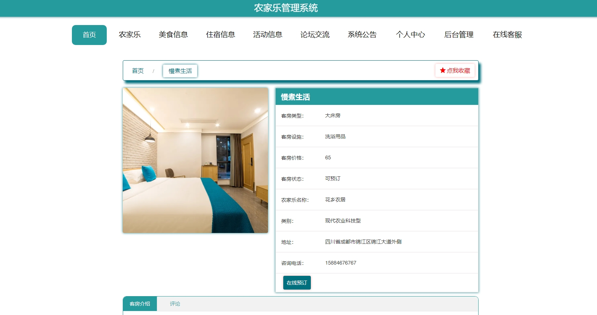
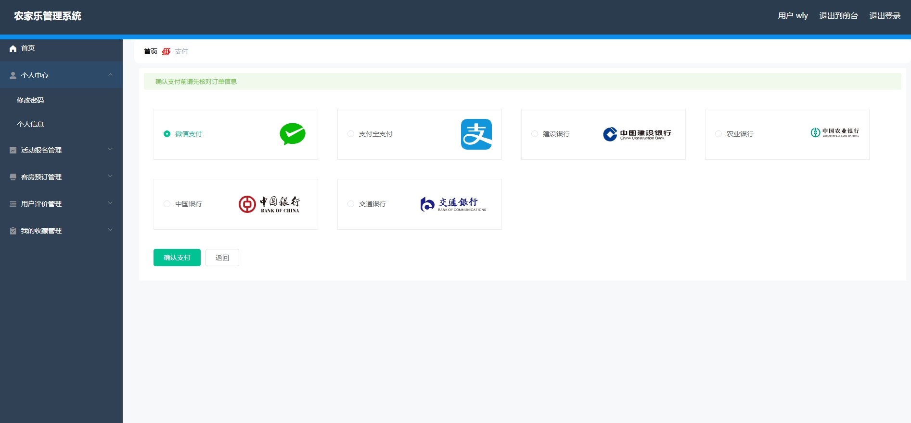
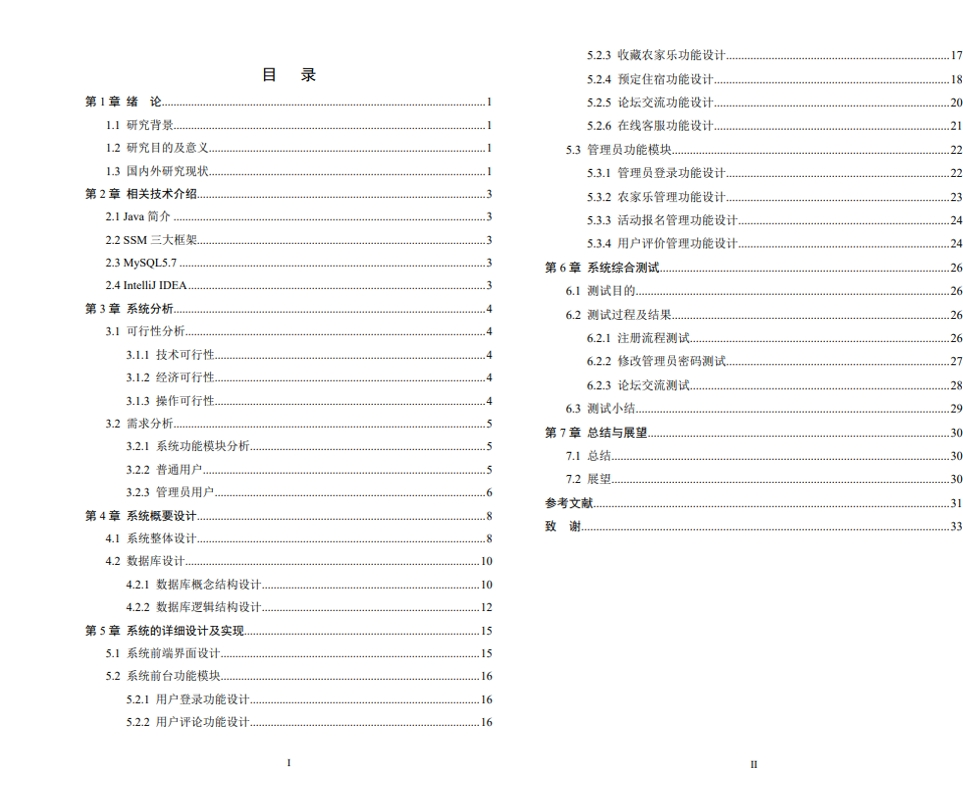

# 4.获取方式
[戳我查看](https://gitee.com/aven999/mall)